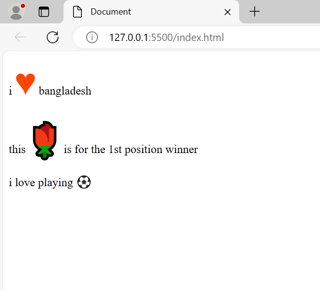

__C__~~S~~_S_
---
Internal css

`<p style="color:green; font-size:20px;"> Hello World!</p>`

### Preview
<p style="color:green; font-size:20px;"> Hello World!</p>

### multiple changes

```html
<head>
    <title></title>
    <style type="text/css">
        h1{
            color:green;
            font-size:20%;
        }
        p{
            color:blue;
            font-size:25%;
        }
    </style>
</head>
```

create a html file. example file.html

```html
<!DOCTYPE html>
<html lang="en">
	<head>
		<meta charset="UTF-8">
		<title>External CSS</title>
		<link rel="stylesheet" type="text/css" href="externalcss.css">
	</head>
		<body>
			<h1> External CSS Tutorial </h1>
			
			<p> 
				Bangladesh, nestled in South Asia, is a land of vibrant culture, rich history, and resilient people. With its lush green landscapes, intricate waterways, and bustling cities, Bangladesh offers a tapestry of experiences to visitors and inhabitants alike.</p>
			
			<p> Despite facing challenges such as frequent natural disasters and socio-economic disparities, the nation displays remarkable resilience and determination. Dhaka, the capital city, pulsates with energy, reflecting the country's dynamic spirit.</p> 
			
			<p> Bangladesh is renowned for its mouthwatering cuisine, from spicy curries to delectable sweets, tantalizing taste buds across the globe. Its cultural heritage, spanning from the ancient ruins of Paharpur to the ornate mosques of Bagerhat, speaks volumes about its diverse past. Moreover, Bangladesh has made significant strides in sectors like textiles, agriculture, and technology, contributing to its growing economy. As it continues to evolve, Bangladesh stands as a testament to the strength of its people and the richness of its heritage.</p>
		</body>
</html>
```

create a css file. example file.css

```css
h1{
text-align:center;
color:lightblue;
}
p{
	text-align:left;
	color:lightgreen;
}
```  


### one style use where it's required "class & id"

`"." use as class`
`"#" use as id`

```html
<!DOCTYPE html>
<html>
	<head>
		<meta charset="UTF-8">
		<title> style use multiple</title>
		<style type="text/css">
			.style-1{
				color:lightblue;
				font-size:75%;
			}
			#paragraph-style1{
				color:green;
			}
		</style>
	</head>
	<body>
		<h1 class="style-1"> This is a tutorial page</h1>
		<h2 class="pargraph-style1"> Read Carefully </h2>

		<p class="style-1"> Bangladesh is renowned for its mouthwatering cuisine, from spicy curries to delectable sweets, tantalizing taste buds across the globe. </p>
		
		<p id="paragraph-style1">Its cultural heritage, spanning from the ancient ruins of Paharpur to the ornate mosques of Bagerhat, speaks volumes about its diverse past. Moreover, Bangladesh has made significant strides in sectors like textiles, agriculture, and technology, contributing to its growing economy.</p>
		
		<p id="paragraph-style1"> As it continues to evolve, Bangladesh stands as a testament to the strength of its people and the richness of its heritage.</p>
	</body>
</html>
```

```html
<!DOCTYPE html>
<html>
	<head>
		<meta charset="utf-8">
		<title>explaination of class and id</title>

		<style type="text/css">
			#section1{
			background-color:lightblue;
			}
			#section1 h1{
			color:green;
			}
			#section1 p{
			color:lightpink;
			}
			.style1{
			color:blue;
			}
			.style2{
			font-size:70;
			}
		</style>
		</head>
		<body>
			<div id="section1">
				<h1> heading </h1>
				<p> this is inside headin paragraph</p>
			</div>			
			</br>
			<div class="style1 style2">
				<h1> heading </h1>
				<p> this is inside headin paragraph</p>
			</div>
		</body>
</html>
```


### universal selector

```html
*{
	background-color:green;
	color:red;
}
```
### multiple group style

```html
h1,p,h2,p2{
	background-color:lightblue;
	color:green;
}
```
### div style Descendant

```html
<style>
div p{
	background-color:green;
	color:red;
}
</style>
<body>
	<div>
		<p>this is p 1</p>
		<p>this is p 2</p>
	</div>
	<p> this is p 3</p>
</body>
```
p 1 & 2 bg and c will change but not paragraph 3.

### child selector

```html
div > p{
	background-color:blue;
	color:red;
}
<body>
	<div>
	<p>para 1</p>
	<p>pare 2</p>
	<section> <p>para 3</p></section>
	</div>
</body>
```
only para 1 and 2 will work without 3
### after divv one paragraph
```html
div + p{
	background-color:red;
	color:blue;
}
<div>
<div>
<p>
```
after div one paragraph

### after div all paragraph

```html
div ~ p{
	background-color:red;
	color:blue;
}
<div>
<div>
<p>
```
### font style

<ol>
<li>font.google.com
<li>copy url past in head
<li>type style name
<li> ok
</ol>

```html
<!DOCTYPE html>
<html lang="en">
	<head>
		<meta charset="utf-8">
		<title> font styling </title>
		<link href="https://fonts.googleapis.com/css2?family=Josefin+Sans:ital,wght@0,100..700;1,100..700&display=swap" rel="stylesheet">
		<style>
			.my-style{
			font-family:fantasy;
			font-size:100%;
			font-width:bold;
			color:lightblue;
			font-style:italic;
			}
			.my-style1{
			font-family: "Josefin Sans";
			}
		</style>
	</head>
	<body>
		<p class="my-style"> this is paragraph 1</p>
		<p class="my-style1"> this is paragraph 1</p>
	</body>
</html>
```


### text decoration

.decoration{
	text-decoration:underline,overline,line-through
}

### first line after tab or gap

text indent

```html
<style>
	.indent{
		text-indent:50px;
	}
</style>
<body>
	<p class="indent"> Bangladesh is renowned for its mouthwatering cuisine, from spicy curries to delectable sweets, tantalizing taste buds across the globe.</p>
</body>
```

it will show

```
	Bangladesh is renowned for its mouthwatering cuisine, from spicy curries to delectable sweets,

 tantalizing taste buds across the globe.
```
```html
<!DOCTYPE html>
<html lang="en">
	<head>
		<meta charset="utf-8">
		<title> page color </title>
		<style>
			.indent{
			text-indent:50px;
			}
			.justify{
			text-align:justify;
			}
			.decoration{
			text-transform:uppercase;
			}
			.decoration1{
			text-shadow:3px 5px silver;
			}
			.decoration3{
			word-spacing:5px;
			}
		</style>
	</head>
	<body>
		<p class="decoration decoration1"> this is paragraph 1</p>
		<p> this is paragraph 2</p>
		<p> this is paragraph 3</p>
		<p class="indent decoration3">Bangladesh is renowned for its mouthwatering cuisine, from spicy curries to delectable sweets, tantalizing taste buds across the globe.</p>
		<p class="justify">Bangladesh is renowned for its mouthwatering cuisine, from spicy curries to delectable sweets, tantalizing taste buds across the globe.Bangladesh is renowned for its mouthwatering cuisine, from spicy curries to delectable sweets, tantalizing taste buds across the globe.Bangladesh is renowned for its mouthwatering cuisine, from spicy curries to delectable sweets, tantalizing taste buds across the globe.Bangladesh is renowned for its mouthwatering cuisine, from spicy curries to delectable sweets, tantalizing taste buds across the globe.Bangladesh is renowned for its mouthwatering cuisine, from spicy curries to delectable sweets, tantalizing taste buds across the globe.</p>
	</body>
</html>
```


### emoji

```html
<!DOCTYPE html>
<html lang="en">
<head>
    <meta charset="UTF-8">
    <meta name="viewport" content="width=device-width, initial-scale=1.0">
    <title>Document</title>
    <link rel="stylesheet" href="style.css">
</head>
<body>
    <p>i <span>♥</span> bangladesh</p>
    <p>this <span>🌹</span> is for the 1st position winner</p>
    <p>i love playing <span class="football">⚽</span></p>
</body>
</html>
```
```css
span{
    color:orangered;
    font-size:3rem;
}
.football{
    font-size:1rem;
}
```


### box model

```html
<!DOCTYPE html>
<html lang="en">
<head>
    <meta charset="UTF-8">
    <meta name="viewport" content="width=device-width, initial-scale=1.0">
    <title>Document</title>
    <style>
        #section{
            margin:20px 30px 10px 20px; <!--top right bottom left;-->
            width:200px;
            background-color:aqua;
        }
        #section1{
            margin-top:30px;
            background-color:cadetblue;
        }
    </style>
</head>
<body>
    <div id="section">
        <p>Bangladesh</p>
    </div>
    <div>
        <p id="section1">Finland</p>
    </div>
</body>
</html>
```


### border

```html
<!DOCTYPE html>
<html lang="en">
<head>
    <meta charset="UTF-8">
    <meta name="viewport" content="width=device-width, initial-scale=1.0">
    <title>Document</title>
    <style>
        h1{
            border:5px double green;
            width: 300px;
        }
        .section1{
            border:3px dotted tomato;
            width:300;
            border-radius:20%;
        }
        h2,h3{
            border-top:3px solid green;
            border-bottom:3px solid rebeccapurple;
            border-left:3px solid yellow;
            border-right:3px solid orange;
            width:300px;
        }
    </style>
</head>
<body>
    <h1>This is heading one</h1>
    <h1 class="section1">This is heading one</h1>
    <h2>this is heading two</h2>
    <h3>this is heading three</h3>
    <h4>this is heading four</h4>
</body>
</html>
```


